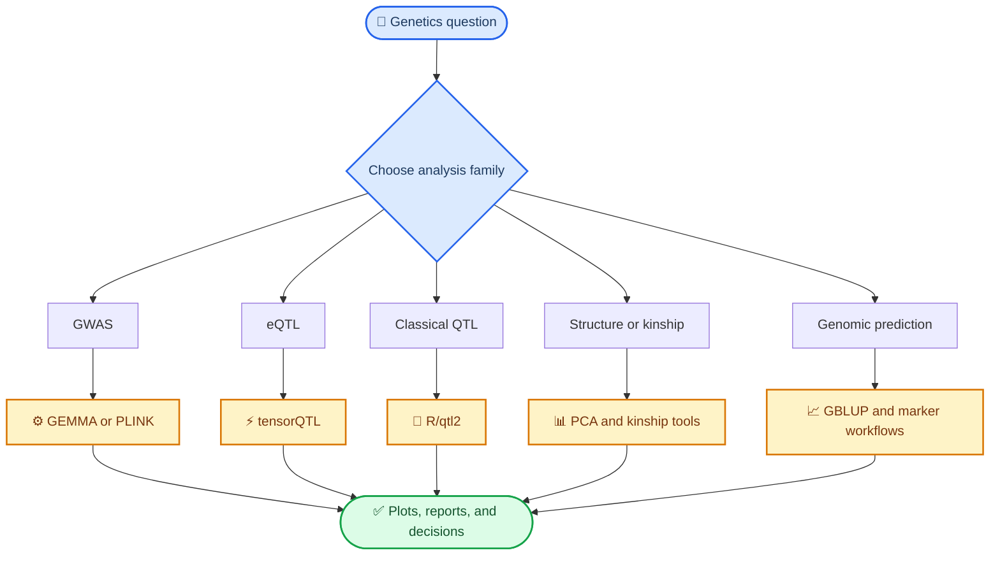
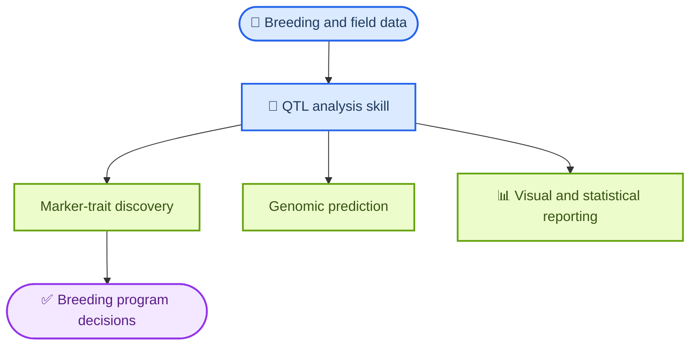

# My Farm QTL Analysis

My Farm QTL Analysis is the genetics and quantitative-analysis skill pack for this repo. It covers GWAS, eQTL mapping, classical QTL workflows, kinship, population structure, genomic prediction, and reporting patterns that turn marker-level results into breeding insight.

Use this skill when the problem is trait-genetics analysis, association mapping, breeding-genomics interpretation, or downstream selection support.

## What This Skill Does

- Routes each QTL-style problem to the right analysis family instead of forcing one tool to do everything.
- Combines the strongest open-source tools for GWAS, eQTLs, classical QTL, kinship, PCA, and genomic prediction.
- Preserves an example-first workflow library with grouped local taxonomy: `mapping/`, `qc/`, `structure/`, `prediction/`, and `reporting/`.
- Includes local visualization and GPU/HPC readiness helpers in addition to the remote baseline CLI wrapper.
- Bridges raw genotype/phenotype data to biological interpretation and breeding decisions.

## Tooling Model

The point of this skill is not one monolithic tool. It is the orchestration layer that chooses the right open-source method for the job.

## Core Capability Areas

| Area | What it covers | Typical output |
| --- | --- | --- |
| GWAS | Linear mixed model and GLM association studies | Manhattan plots, QQ plots, hit tables |
| eQTL | cis/trans expression QTL mapping | gene-variant association results |
| Classical QTL | Experimental-cross QTL workflows | LOD scans and linkage-based QTL calls |
| Population Structure | PCA, admixture, kinship, relatedness | structure plots and kinship matrices |
| Genomic Prediction | GBLUP and breeding prediction workflows | prediction accuracy and selection guidance |
| QC and Annotation | SNP filtering, validation, and annotation | cleaned genotype inputs and annotated markers |

## Grouped Example Taxonomy

The imported local structure groups examples by workflow family instead of a flat `examples/` catalog.

| Group | Representative examples |
| --- | --- |
| `examples/mapping/` | `gwas-lmm/`, `gwas-glm/`, `eqtl-cis/`, `classical-qtl/`, `multi-trait-gwas/` |
| `examples/qc/` | `vcf-validation/`, `snp-filtering/`, `sample-qc/`, `snp-annotation/`, `imputation/` |
| `examples/structure/` | `population-structure/`, `admixture/`, `ld-decay/`, `haplotype-analysis/`, `genomic-nrm/` |
| `examples/prediction/` | `genomic-prediction/`, `marker-selection/`, `blup/`, `bayesian-gp/`, `backcross-selection/` |
| `examples/reporting/` | `qmapper-ideogram/`, `analysis-report/`, `real-dataset/` |

## Local Wins Preserved

- `scripts/verify_gpu_hpc.py` provides a local CUDA/HPC readiness check before tensorQTL-style workflows.
- `VISUALIZATION_SUMMARY.md` preserves the local visualization research bundle.
- Example modules remain organized by grouped taxonomy rather than being flattened back to the remote baseline layout.
- `scripts/qtl_cli.py` is available as an optional helper, but the primary usage model remains example-first.

## End-to-End Analysis Flow

## Why It Matters In This Repo

This skill is the analysis-heavy counterpart to breeding trial management. Trial management helps run the breeding program; QTL analysis helps explain the genetics and rank what to do next.

## Start Here

- Main entrypoint: [`SKILL.md`](SKILL.md)
- Progressive router: [`INDEX.md`](INDEX.md)
- Visualization research summary: [`VISUALIZATION_SUMMARY.md`](VISUALIZATION_SUMMARY.md)
- Optional helper CLI: [`scripts/qtl_cli.py`](scripts/qtl_cli.py)
- Common baselines: `examples/mapping/gwas-lmm/`, `examples/mapping/eqtl-cis/`, `examples/mapping/classical-qtl/`, `examples/prediction/genomic-prediction/`
